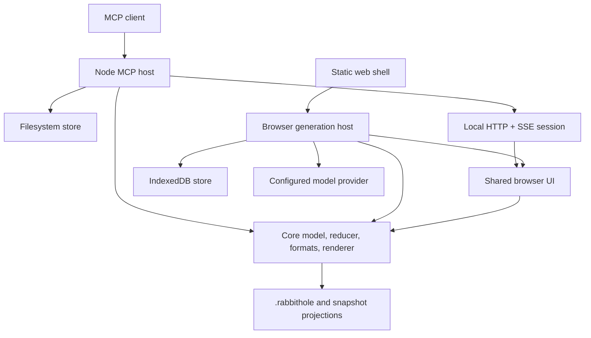

# Rabbithole architecture

Rabbithole is one branching-document product with two hosts:

- a local MCP server, where an external agent generates answers and a local
  browser tab provides the interface;
- a static web app, where the browser calls a user-selected model provider and
  stores data locally.

Both hosts use the same document engine, content renderer, canvas UI, storage
contract, and portable artifact formats. They intentionally retain different
generation and lifecycle responsibilities.

## Runtime map

The source tree follows those boundaries:

| Path | Responsibility |
|---|---|
| `src/core/` | Environment-independent model, reducer, schema, storage port, Markdown/content behavior, prompts, and artifact projections. Reviewed interface declarations live in `src/core/contracts/`. |
| `src/ui/` | Browser reader, canvas, overlays, primitives, rendering, transport adapter, and snapshot controls shared by both hosts. |
| `src/node/` | Filesystem persistence, PDF ingestion, MCP tools, local HTTP/SSE sessions, and browser launch behavior. |
| `src/web/` | Static app shell, IndexedDB persistence, provider adapters, browser generation, settings, imports, and library navigation. |
| `workers/fetch-proxy/` | Optional allowlisted relay for URL ingestion when a source blocks browser CORS. |
| `build.mjs` | Browser bundles and static web-app assembly. |

## Dependency direction

`src/core` is the base layer. It must not import `src/ui` or `src/node`, and it
must not depend on Node built-ins. `src/ui` may import `src/core`, but it must
remain browser-only and may not reach into either host. The Node and web hosts
compose the lower layers and own environment-specific I/O.

The web host may use shared UI primitives and the UI entry point. The Node and
web hosts do not import one another. `npm run check:purity` enforces the core and
UI portions of these rules.

## Document model and projections

Markdown is the authoritative source for document content; rendered HTML is
derived. At runtime, each host represents a hole as `HoleState`: document
metadata plus a map of nodes. Hosts change that state through `DocEvent` values
handled by `reduceHoleEvent`. The reducer returns the next state and effects;
the host owns persistence, network traffic, generation, and scheduling.

The canonical durable document is the versioned persisted-hole schema in
`src/core/schema.js`. Both storage implementations conform to the port in
`src/core/store.js`:

- the MCP host stores one JSON document per hole and binary assets below
  `~/.rabbithole/` (or `RABBITHOLE_DIR`);
- the web host stores documents and assets in IndexedDB.

Other representations are projections of that document:

- browser hydration converts the node map to transport-ready node records;
- a `.rabbithole` file wraps a persisted hole and its base64 assets in the
  versioned portable format;
- a frozen snapshot embeds a deliberately shareable projection, referenced
  assets, styles, sanitizer, and frozen client in one inert HTML file.

Schema migration and validation happen at storage and import boundaries.
Unsupported future versions are refused rather than reconstructed lossy.
Credentials and provider preferences are device-local web state, never part of
the document or its exported projections. See [Compatibility](docs/compatibility.md)
for the supported contracts.

## Host boundaries

### MCP host

`bin/mcp-server.js` starts the stdio MCP server in `src/node/mcp/server.js`.
Tool calls create or resume a `RabbitHoleSession`, which serves a self-contained
canvas over a loopback HTTP server and sends live changes over SSE. The MCP
server is passive with respect to generation: the external agent receives a
branch request and streams the answer back through `answer_branch`.

Standard output is reserved for MCP protocol messages. Node diagnostics must go
through the stderr logger.

### Web host

`src/web/app.js` composes the static browser application. `DirectRabbitholeHost`
owns the reducer, provider-driven generation, save queue, and transport adapter;
`IdbStore` owns durable browser data. Provider keys remain in browser storage and
are sent only to the configured provider origin.

Changing the open hole is an in-document transition. The app serializes hole
changes, flushes pending UI and host saves, disposes the old UI and transport,
releases asset object URLs, resets the canvas surface, and mounts the target.

## Live and frozen UI

`src/ui/composition.js` is the shared composition boundary. It creates one
owned UI lifetime per mounted hole and returns `flush()` and idempotent
`dispose()` operations. `src/ui/entry.js` supplies live persistence, transport,
and export capabilities without placing those host modules in shared UI code.

`src/ui/frozen-entry.js` calls the same composition boundary without writable
capabilities. It is built as a separate entry so frozen HTML does not acquire
provider, settings, IndexedDB, snapshot-export, or live transport code.

Each module registers listeners, timers, overlays, animation frames, and
subscriptions beside the code that creates them. Runtime disposal drains those
resources in dependency order before core DOM references are cleared. A bundle
contract test prevents frozen artifacts from importing live transport,
snapshot-export, or web-host modules; byte and snapshot budgets remain separate
acceptance gates.

## Build and delivery

The source is plain ES modules and requires no runtime compilation. The build is
used to create browser artifacts:

- `dist/client.js` and `dist/frozen-client.js` are the live and frozen UI
  bundles used by the local MCP host;
- `dist/dompurify.js` and `dist/katex.css` provide self-contained sanitizer,
  math, and font assets;
- `web/dist/` is the ignored static browser application assembled from the web
  shell and browser bundles;
- `publish/` is the ignored Cloudflare Pages payload produced by
  `npm run build:publish`.

`dist/` is committed because GitHub `npx` installs run the MCP server directly
without a prepare step. Source changes that affect it must include regenerated
artifacts, and `npm run check:dist` verifies byte-for-byte reproducibility.

Both a live MCP canvas page and an exported frozen snapshot are assembled as one
self-contained HTML response. That constraint is load-bearing: do not introduce
external runtime assets into either artifact. The hosted web app may consist of
multiple static files, but the snapshots it exports remain self-contained.

For validation and change guidance, see [CONTRIBUTING.md](CONTRIBUTING.md) and
[Testing Rabbithole](docs/testing.md).
